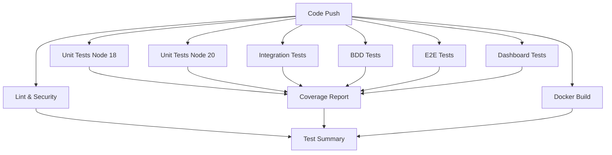
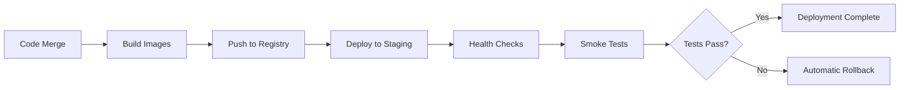
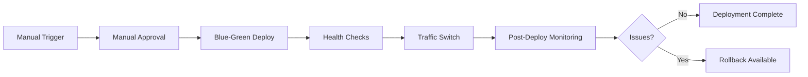

# GitHub Actions CI/CD Workflows

This directory contains the GitHub Actions workflows for the Nellis Auction Helper project, providing comprehensive CI/CD, testing, and security automation.

## 🚀 Workflows Overview

### 1. CI/CD Pipeline (`ci.yml`)
**Trigger**: Push/PR to main/develop branches  
**Purpose**: Main continuous integration pipeline

**Jobs:**
- **Code Quality & Security**: ESLint, security audit
- **Unit Tests**: Fast feedback with Node.js 18/20 matrix
- **Integration Tests**: With Redis service container
- **BDD Tests**: Cucumber/Gherkin scenarios
- **E2E Tests**: Puppeteer browser automation
- **Dashboard Tests**: Frontend testing
- **Docker Build & Test**: Container security and build validation
- **Coverage Report**: Aggregated coverage from all test suites
- **Test Summary**: Comprehensive results overview

**Features:**
- ✅ Parallel test execution for speed
- ✅ Comprehensive caching strategy
- ✅ Service containers for dependencies
- ✅ Cross-platform Node.js testing
- ✅ Security vulnerability scanning
- ✅ Coverage reporting and aggregation
- ✅ Docker layer caching

### 2. Staging Deployment (`deploy-staging.yml`)
**Trigger**: Push to main branch, manual dispatch  
**Purpose**: Automated staging deployment with production option

**Jobs:**
- **Build & Push**: Docker images to GitHub Container Registry
- **Deploy Staging**: Zero-downtime deployment to staging environment
- **Deploy Production**: Manual approval required, blue-green deployment
- **Post-Deployment Monitoring**: Health checks and metrics validation

**Features:**
- ✅ Container registry integration
- ✅ Zero-downtime deployment strategy
- ✅ Automated rollback on failure
- ✅ Smoke tests post-deployment
- ✅ Environment-specific configurations
- ✅ Manual approval gates for production

### 3. Scheduled Tests (`scheduled-tests.yml`)
**Trigger**: Cron schedules, manual dispatch  
**Purpose**: Regular testing and health monitoring

**Schedules:**
- **Daily Full Test**: 2 AM UTC - Comprehensive test suite
- **E2E Tests**: Every 6 hours - Browser automation tests
- **Performance Tests**: On-demand - Performance benchmarking

**Jobs:**
- **Daily Full Test**: Complete test suite execution
- **Scheduled E2E**: Regular browser automation testing
- **Performance Tests**: Benchmark and performance validation
- **Test Health Check**: Infrastructure validation
- **Cleanup**: Old artifact removal
- **Report Status**: Test status summary

### 4. Security Audit (`security-audit.yml`)
**Trigger**: Daily at 6 AM UTC, manual dispatch  
**Purpose**: Comprehensive security monitoring

**Jobs:**
- **NPM Security Audit**: Dependency vulnerability scanning
- **Docker Security Scan**: Container image security with Trivy
- **Code Security Analysis**: Static analysis with CodeQL and Semgrep
- **Dependency Update Check**: Outdated package detection
- **Security Configuration Check**: Configuration security review
- **Security Report**: Comprehensive security summary
- **Create Security Issue**: Automatic issue creation for vulnerabilities

## 🔧 Configuration

### Required Secrets

For staging/production deployment:
```bash
# Staging Environment
STAGING_SSH_KEY          # SSH private key for staging server
STAGING_HOST             # Staging server hostname/IP
STAGING_USER             # SSH username for staging server
STAGING_AUTH_TOKEN       # Authentication token for staging API

# Production Environment  
PRODUCTION_SSH_KEY       # SSH private key for production server
PRODUCTION_HOST          # Production server hostname/IP
PRODUCTION_USER          # SSH username for production server
PRODUCTION_AUTH_TOKEN    # Authentication token for production API

# Container Registry
GITHUB_TOKEN             # Automatically provided by GitHub
```

### Environment Variables

The workflows use these environment variables:
```yaml
NODE_VERSION: '18'        # Default Node.js version
CACHE_VERSION: v1         # Cache versioning for invalidation
REGISTRY: ghcr.io         # Container registry
IMAGE_NAME: ${{ github.repository }}  # Image naming
```

## 📊 Test Execution Strategy

### Parallel Test Execution


### Test Types and Coverage

| Test Type | Framework | Coverage | Duration | Frequency |
|-----------|-----------|----------|----------|-----------|
| Unit | Jest | 80%+ required | ~2-3 min | Every push |
| Integration | Jest + Redis | Service integration | ~3-5 min | Every push |
| BDD | Cucumber | Business scenarios | ~5-8 min | Every push |
| E2E | Puppeteer | User workflows | ~8-12 min | Every push + 6h schedule |
| Performance | Custom | Benchmarks | ~5-10 min | On-demand |

## 🚀 Deployment Strategy

### Staging Deployment Flow


### Production Deployment Flow


## 📈 Monitoring and Reporting

### Test Results
- **GitHub Actions Summary**: Real-time test results and coverage
- **Artifacts**: Test reports, coverage files, screenshots, videos
- **PR Comments**: Coverage changes and test status
- **Slack/Email**: Failure notifications (configurable)

### Security Monitoring
- **Daily Audits**: Automated vulnerability scanning
- **SARIF Reports**: Security findings uploaded to GitHub Security tab
- **Automatic Issues**: Created for critical vulnerabilities
- **Dependency Tracking**: Outdated package monitoring

### Performance Tracking
- **Benchmark Reports**: Performance regression detection
- **Resource Usage**: Memory and CPU monitoring
- **Response Times**: API performance tracking
- **Load Testing**: Capacity validation

## 🛠️ Customization

### Adding New Test Suites

1. **Create test job in `ci.yml`**:
```yaml
new-test-suite:
  name: New Test Suite
  runs-on: ubuntu-latest
  steps:
    - uses: actions/checkout@v4
    - name: Run New Tests
      run: npm run test:new-suite
```

2. **Add to coverage aggregation**:
```yaml
coverage-report:
  needs: [..., new-test-suite]
```

3. **Update test summary**:
```yaml
test-summary:
  needs: [..., new-test-suite]
```

### Modifying Deployment Strategy

**For different deployment targets**:
1. Add new environment secrets
2. Create environment-specific job
3. Configure deployment scripts
4. Set up health checks

**For different testing schedules**:
1. Modify cron expressions in `scheduled-tests.yml`
2. Adjust test timeout values
3. Configure notification preferences

## 🔍 Troubleshooting

### Common Issues

**Tests failing in CI but passing locally:**
- Check Node.js version matrix
- Verify environment variables
- Review service container setup
- Check file path differences (case sensitivity)

**Docker build failures:**
- Verify Dockerfile syntax
- Check base image availability
- Review cache invalidation
- Ensure proper layer ordering

**Deployment failures:**
- Verify SSH key permissions
- Check server connectivity
- Review environment configuration
- Validate health check endpoints

**Security scan false positives:**
- Review `.trivyignore` file
- Update vulnerability databases
- Configure scan sensitivity levels
- Add exceptions for known issues

### Debug Commands

**Local test reproduction:**
```bash
# Run tests with same environment as CI
NODE_ENV=test npm test

# Docker build testing
docker build -t test-image .
docker run --rm test-image npm test

# Security scanning
docker run --rm -v $(pwd):/workspace aquasec/trivy:latest fs /workspace
```

**Workflow debugging:**
- Enable debug logging: Set `ACTIONS_STEP_DEBUG=true`
- Use `actions/toolkit` for complex scripts
- Add intermediate artifact uploads
- Use `tmate` action for SSH debugging

## 📚 Best Practices

### Workflow Design
- ✅ Keep jobs focused and single-purpose
- ✅ Use caching extensively for performance
- ✅ Implement proper error handling
- ✅ Use matrix builds for compatibility testing
- ✅ Minimize job dependencies for parallelization

### Security
- ✅ Use minimal permissions principle
- ✅ Pin action versions to specific commits
- ✅ Regularly update dependencies
- ✅ Scan for secrets in code
- ✅ Use environment-specific configurations

### Performance
- ✅ Cache node_modules and build artifacts
- ✅ Use appropriate timeouts
- ✅ Optimize Docker layer caching
- ✅ Run fast tests first for early feedback
- ✅ Use appropriate runner sizes

### Maintenance
- ✅ Regular workflow health checks
- ✅ Monitor action marketplace for updates
- ✅ Review and update test timeouts
- ✅ Clean up old artifacts regularly
- ✅ Document workflow changes

## 📞 Support

For issues with the CI/CD workflows:

1. **Check workflow logs** in GitHub Actions tab
2. **Review this documentation** for configuration details
3. **Check recent commits** for breaking changes
4. **Verify secrets and environment** variables
5. **Create an issue** with workflow run URL and error details

---

**Last Updated**: June 29, 2025  
**Workflow Version**: 1.0  
**Maintained By**: DevOps Team