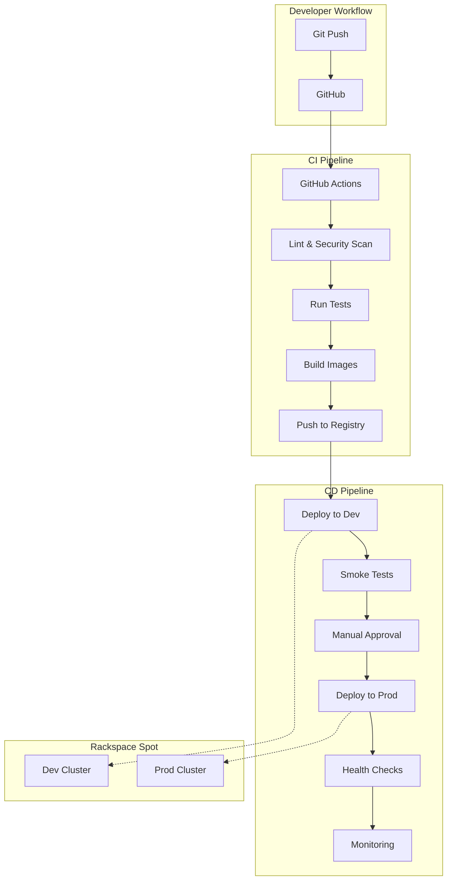

# CI/CD Implementation Plan for Auction Tracker on Rackspace Spot

## Executive Summary

This document outlines a comprehensive CI/CD implementation plan for deploying the Auction Tracker application to a Kubernetes cluster hosted on Rackspace Spot. The plan addresses the current infrastructure gaps and provides a phased approach to establish a robust, automated deployment pipeline.

## Current State Assessment

### Strengths
- ✅ Well-structured multi-tier application (Backend, Dashboard, Extension)
- ✅ Comprehensive test coverage (unit, integration, E2E, BDD)
- ✅ Docker containerization with multi-stage builds
- ✅ Kubernetes manifests with Kustomize overlays
- ✅ Environment-based configuration management
- ✅ Health monitoring and observability hooks

### Gaps Identified
- ❌ No CI/CD pipeline configuration
- ❌ Missing container registry integration
- ❌ No automated secret management
- ❌ Lack of linting and code quality gates
- ❌ No automated extension packaging
- ❌ Missing semantic versioning
- ❌ No deployment rollback automation

## CI/CD Architecture



## Implementation Phases

### Phase 1: CI Pipeline Foundation (Week 1-2)

#### 1.1 GitHub Actions Setup
Create `.github/workflows/ci.yml`:

```yaml
name: CI Pipeline

on:
  push:
    branches: [main, develop]
  pull_request:
    branches: [main]

env:
  REGISTRY: ghcr.io
  IMAGE_PREFIX: ${{ github.repository }}

jobs:
  lint-and-test:
    runs-on: ubuntu-latest
    strategy:
      matrix:
        service: [backend, dashboard]
    
    steps:
      - uses: actions/checkout@v4
      
      - name: Setup Node.js
        uses: actions/setup-node@v4
        with:
          node-version: '18'
          cache: 'npm'
          cache-dependency-path: '${{ matrix.service }}/package-lock.json'
      
      - name: Install dependencies
        working-directory: ${{ matrix.service }}
        run: npm ci
      
      - name: Lint
        working-directory: ${{ matrix.service }}
        run: npm run lint
      
      - name: Run tests
        working-directory: ${{ matrix.service }}
        run: npm run test:ci
        env:
          CI: true
      
      - name: Upload coverage
        uses: codecov/codecov-action@v3
        with:
          directory: ${{ matrix.service }}/coverage

  build-and-push:
    needs: lint-and-test
    runs-on: ubuntu-latest
    if: github.event_name == 'push'
    
    strategy:
      matrix:
        include:
          - service: backend
            dockerfile: backend/Dockerfile
            context: .
          - service: dashboard
            dockerfile: dashboard/Dockerfile
            context: dashboard
    
    steps:
      - uses: actions/checkout@v4
      
      - name: Set up Docker Buildx
        uses: docker/setup-buildx-action@v3
      
      - name: Log in to Container Registry
        uses: docker/login-action@v3
        with:
          registry: ${{ env.REGISTRY }}
          username: ${{ github.actor }}
          password: ${{ secrets.GITHUB_TOKEN }}
      
      - name: Extract metadata
        id: meta
        uses: docker/metadata-action@v5
        with:
          images: ${{ env.REGISTRY }}/${{ env.IMAGE_PREFIX }}-${{ matrix.service }}
          tags: |
            type=ref,event=branch
            type=ref,event=pr
            type=semver,pattern={{version}}
            type=sha,prefix={{branch}}-
      
      - name: Build and push
        uses: docker/build-push-action@v5
        with:
          context: ${{ matrix.context }}
          file: ${{ matrix.dockerfile }}
          push: true
          tags: ${{ steps.meta.outputs.tags }}
          labels: ${{ steps.meta.outputs.labels }}
          cache-from: type=gha
          cache-to: type=gha,mode=max
          target: production

  security-scan:
    needs: build-and-push
    runs-on: ubuntu-latest
    steps:
      - uses: actions/checkout@v4
      
      - name: Run Trivy vulnerability scanner
        uses: aquasecurity/trivy-action@master
        with:
          image-ref: ${{ env.REGISTRY }}/${{ env.IMAGE_PREFIX }}-backend:${{ github.sha }}
          format: 'sarif'
          output: 'trivy-results.sarif'
      
      - name: Upload Trivy scan results
        uses: github/codeql-action/upload-sarif@v2
        with:
          sarif_file: 'trivy-results.sarif'
```

#### 1.2 Code Quality Setup

Create `.eslintrc.js` for backend and dashboard:

```javascript
module.exports = {
  env: {
    es2021: true,
    node: true,
    jest: true
  },
  extends: [
    'eslint:recommended',
    'plugin:security/recommended'
  ],
  parserOptions: {
    ecmaVersion: 12,
    sourceType: 'module'
  },
  plugins: ['security'],
  rules: {
    'no-console': ['error', { allow: ['warn', 'error'] }],
    'no-unused-vars': ['error', { argsIgnorePattern: '^_' }],
    'security/detect-object-injection': 'off'
  }
};
```

Create `.prettierrc`:

```json
{
  "semi": true,
  "trailingComma": "es5",
  "singleQuote": true,
  "printWidth": 100,
  "tabWidth": 2
}
```

### Phase 2: CD Pipeline & Rackspace Integration (Week 3-4)

#### 2.1 Rackspace Spot Authentication

Create `.github/workflows/cd.yml`:

```yaml
name: CD Pipeline

on:
  workflow_run:
    workflows: ["CI Pipeline"]
    types: [completed]
    branches: [main]

jobs:
  deploy-dev:
    if: ${{ github.event.workflow_run.conclusion == 'success' }}
    runs-on: ubuntu-latest
    environment: development
    
    steps:
      - uses: actions/checkout@v4
      
      - name: Setup kubectl
        uses: azure/setup-kubectl@v3
        with:
          version: 'v1.28.0'
      
      - name: Configure Rackspace Spot access
        run: |
          # Create kubeconfig from secrets
          mkdir -p ~/.kube
          echo "${{ secrets.RACKSPACE_KUBECONFIG }}" | base64 -d > ~/.kube/config
          
          # Test connection
          kubectl cluster-info
      
      - name: Deploy to development
        run: |
          # Update image tags in kustomization
          cd k8s/overlays/development
          kustomize edit set image \
            auction-tracker-backend=${{ env.REGISTRY }}/${{ env.IMAGE_PREFIX }}-backend:${{ github.sha }} \
            auction-tracker-dashboard=${{ env.REGISTRY }}/${{ env.IMAGE_PREFIX }}-dashboard:${{ github.sha }}
          
          # Apply manifests
          kustomize build . | kubectl apply -f -
          
          # Wait for rollout
          kubectl -n auction-tracker-dev rollout status deployment/dev-backend
          kubectl -n auction-tracker-dev rollout status deployment/dev-dashboard
      
      - name: Run smoke tests
        run: |
          # Port forward for testing
          kubectl -n auction-tracker-dev port-forward service/dev-backend 3000:3000 &
          sleep 5
          
          # Health check
          curl -f http://localhost:3000/health || exit 1
          
          # API smoke test
          curl -f -H "Authorization: ${{ secrets.DEV_AUTH_TOKEN }}" \
            http://localhost:3000/api/auctions || exit 1

  deploy-prod:
    needs: deploy-dev
    runs-on: ubuntu-latest
    environment: production
    
    steps:
      - uses: actions/checkout@v4
      
      - name: Configure Rackspace Spot access
        run: |
          mkdir -p ~/.kube
          echo "${{ secrets.RACKSPACE_KUBECONFIG_PROD }}" | base64 -d > ~/.kube/config
      
      - name: Create secrets
        run: |
          # Only create if they don't exist
          kubectl -n auction-tracker get secret app-secrets || \
          kubectl -n auction-tracker create secret generic app-secrets \
            --from-literal=auth-token="${{ secrets.AUTH_TOKEN }}" \
            --from-literal=encryption-secret="${{ secrets.ENCRYPTION_SECRET }}" \
            --from-literal=redis-password="${{ secrets.REDIS_PASSWORD }}"
      
      - name: Deploy to production
        run: |
          cd k8s/overlays/production
          kustomize edit set image \
            auction-tracker-backend=${{ env.REGISTRY }}/${{ env.IMAGE_PREFIX }}-backend:${{ github.sha }} \
            auction-tracker-dashboard=${{ env.REGISTRY }}/${{ env.IMAGE_PREFIX }}-dashboard:${{ github.sha }}
          
          # Deploy with canary strategy
          kustomize build . | kubectl apply -f -
          
          # Monitor deployment
          kubectl -n auction-tracker rollout status deployment/backend --timeout=10m
          kubectl -n auction-tracker rollout status deployment/dashboard --timeout=10m
```

#### 2.2 Secret Management

Create `k8s/base/backend/secret-provider.yaml`:

```yaml
apiVersion: v1
kind: ServiceAccount
metadata:
  name: backend-sa
  annotations:
    iam.gke.io/gcp-service-account: auction-tracker@project.iam.gserviceaccount.com
---
apiVersion: secrets-store.csi.x-k8s.io/v1
kind: SecretProviderClass
metadata:
  name: auction-secrets
spec:
  provider: vault
  parameters:
    vaultAddress: "https://vault.rackspace.com"
    roleName: "auction-tracker"
    objects: |
      - objectName: "auth-token"
        secretPath: "secret/data/auction-tracker/backend"
        secretKey: "auth-token"
      - objectName: "encryption-secret"
        secretPath: "secret/data/auction-tracker/backend"
        secretKey: "encryption-secret"
      - objectName: "redis-password"
        secretPath: "secret/data/auction-tracker/redis"
        secretKey: "password"
```

### Phase 3: Advanced Features (Week 5-6)

#### 3.1 Extension Packaging Automation

Create `.github/workflows/extension.yml`:

```yaml
name: Extension Build

on:
  push:
    paths:
      - 'extension/**'
      - '.github/workflows/extension.yml'

jobs:
  build-extension:
    runs-on: ubuntu-latest
    
    steps:
      - uses: actions/checkout@v4
      
      - name: Setup Chrome
        uses: browser-actions/setup-chrome@latest
      
      - name: Validate manifest
        run: |
          python3 -m json.tool extension/manifest.json > /dev/null
      
      - name: Package extension
        run: |
          cd extension
          VERSION=$(grep '"version"' manifest.json | cut -d'"' -f4)
          zip -r "../auction-tracker-${VERSION}.zip" . \
            -x "*.git*" \
            -x "*test*" \
            -x "*.md"
      
      - name: Upload artifact
        uses: actions/upload-artifact@v3
        with:
          name: extension-package
          path: auction-tracker-*.zip
      
      - name: Create release
        if: startsWith(github.ref, 'refs/tags/')
        uses: softprops/action-gh-release@v1
        with:
          files: auction-tracker-*.zip
```

#### 3.2 Monitoring & Observability

Create `k8s/base/monitoring/prometheus-config.yaml`:

```yaml
apiVersion: v1
kind: ConfigMap
metadata:
  name: prometheus-config
data:
  prometheus.yml: |
    global:
      scrape_interval: 15s
    
    scrape_configs:
      - job_name: 'auction-backend'
        kubernetes_sd_configs:
          - role: pod
            namespaces:
              names: ['auction-tracker', 'auction-tracker-dev']
        relabel_configs:
          - source_labels: [__meta_kubernetes_pod_label_app]
            action: keep
            regex: backend
          - source_labels: [__meta_kubernetes_pod_annotation_prometheus_io_scrape]
            action: keep
            regex: true
          - source_labels: [__meta_kubernetes_pod_annotation_prometheus_io_path]
            action: replace
            target_label: __metrics_path__
            regex: (.+)
```

#### 3.3 Rollback Strategy

Create `.github/workflows/rollback.yml`:

```yaml
name: Rollback Deployment

on:
  workflow_dispatch:
    inputs:
      environment:
        description: 'Environment to rollback'
        required: true
        type: choice
        options:
          - development
          - production
      revision:
        description: 'Number of revisions to rollback (default: 1)'
        required: false
        default: '1'

jobs:
  rollback:
    runs-on: ubuntu-latest
    environment: ${{ github.event.inputs.environment }}
    
    steps:
      - name: Configure kubectl
        run: |
          mkdir -p ~/.kube
          if [ "${{ github.event.inputs.environment }}" = "production" ]; then
            echo "${{ secrets.RACKSPACE_KUBECONFIG_PROD }}" | base64 -d > ~/.kube/config
            NAMESPACE="auction-tracker"
          else
            echo "${{ secrets.RACKSPACE_KUBECONFIG }}" | base64 -d > ~/.kube/config
            NAMESPACE="auction-tracker-dev"
          fi
          echo "NAMESPACE=$NAMESPACE" >> $GITHUB_ENV
      
      - name: Rollback deployments
        run: |
          # Rollback backend
          kubectl -n ${{ env.NAMESPACE }} rollout undo deployment/backend \
            --to-revision=${{ github.event.inputs.revision }}
          
          # Rollback dashboard
          kubectl -n ${{ env.NAMESPACE }} rollout undo deployment/dashboard \
            --to-revision=${{ github.event.inputs.revision }}
          
          # Wait for rollout
          kubectl -n ${{ env.NAMESPACE }} rollout status deployment/backend
          kubectl -n ${{ env.NAMESPACE }} rollout status deployment/dashboard
      
      - name: Verify health
        run: |
          # Get service endpoint
          BACKEND_IP=$(kubectl -n ${{ env.NAMESPACE }} get service backend -o jsonpath='{.status.loadBalancer.ingress[0].ip}')
          
          # Health check
          curl -f http://${BACKEND_IP}:3000/health || exit 1
```

## Security Considerations

### 1. Secrets Management
- Use GitHub Secrets for CI/CD credentials
- Implement HashiCorp Vault or Rackspace Key Manager for runtime secrets
- Rotate credentials regularly (90-day policy)
- Never commit secrets to repository

### 2. Image Security
- Scan all images with Trivy before deployment
- Use distroless or Alpine base images
- Run containers as non-root user
- Implement admission controllers (OPA/Gatekeeper)

### 3. Network Security
- Implement NetworkPolicies for pod-to-pod communication
- Use TLS for all external endpoints
- Implement WAF rules for public endpoints
- Regular security audits with kube-bench

### 4. RBAC Configuration
```yaml
apiVersion: rbac.authorization.k8s.io/v1
kind: Role
metadata:
  name: ci-deployer
  namespace: auction-tracker
rules:
  - apiGroups: ["apps", ""]
    resources: ["deployments", "services", "configmaps"]
    verbs: ["get", "list", "update", "patch"]
  - apiGroups: [""]
    resources: ["pods", "pods/log"]
    verbs: ["get", "list"]
```

## Monitoring & Alerting

### 1. Key Metrics to Track
- Deployment frequency
- Lead time for changes
- Mean time to recovery (MTTR)
- Change failure rate
- Application performance (response time, error rate)
- Resource utilization

### 2. Alerting Rules
```yaml
groups:
  - name: auction-tracker
    rules:
      - alert: DeploymentFailed
        expr: |
          kube_deployment_status_replicas_unavailable{namespace=~"auction-tracker.*"} > 0
        for: 5m
        annotations:
          summary: "Deployment {{ $labels.deployment }} has unavailable replicas"
      
      - alert: HighErrorRate
        expr: |
          rate(http_requests_total{status=~"5.."}[5m]) > 0.05
        for: 5m
        annotations:
          summary: "High error rate detected: {{ $value | humanizePercentage }}"
```

## Cost Optimization

### 1. Resource Management
- Implement HPA for auto-scaling
- Use spot instances for non-critical workloads
- Right-size resource requests/limits
- Implement pod disruption budgets

### 2. Image Optimization
- Multi-stage builds to reduce image size
- Layer caching in CI/CD
- Regular cleanup of unused images
- Use image pull policies wisely

## Implementation Timeline

| Week | Phase | Deliverables |
|------|-------|--------------|
| 1-2 | CI Foundation | GitHub Actions, linting, testing automation |
| 3-4 | CD & Rackspace | Deployment automation, secret management |
| 5-6 | Advanced Features | Extension packaging, monitoring, rollback |
| 7 | Testing & Optimization | Load testing, performance tuning |
| 8 | Documentation & Training | Runbooks, team training, handover |

## Success Criteria

1. **Automation**: 100% automated deployments with zero manual steps
2. **Reliability**: 99.9% deployment success rate
3. **Speed**: < 15 minutes from commit to production
4. **Security**: All images scanned, secrets managed externally
5. **Observability**: Full visibility into deployment pipeline
6. **Rollback**: < 5 minutes to rollback any deployment

## Next Steps

1. **Immediate Actions**:
   - Create GitHub repository secrets
   - Set up Rackspace Spot service account
   - Initialize linting configurations
   - Create CI pipeline PR

2. **Prerequisites**:
   - Rackspace Spot cluster access credentials
   - Container registry decision (GitHub Packages vs Rackspace)
   - Monitoring infrastructure setup
   - Team training on new workflows

3. **Risk Mitigation**:
   - Maintain manual deployment option during transition
   - Implement gradual rollout (dev → staging → prod)
   - Create comprehensive rollback procedures
   - Document all processes thoroughly

## Appendix: Useful Commands

```bash
# Generate kubeconfig for CI/CD
kubectl create serviceaccount ci-deployer -n auction-tracker
kubectl create rolebinding ci-deployer-binding \
  --role=ci-deployer \
  --serviceaccount=auction-tracker:ci-deployer \
  -n auction-tracker

# Get service account token
TOKEN=$(kubectl -n auction-tracker get secret \
  $(kubectl -n auction-tracker get sa ci-deployer -o jsonpath='{.secrets[0].name}') \
  -o jsonpath='{.data.token}' | base64 -d)

# Create kubeconfig for CI/CD
kubectl config set-credentials ci-deployer --token=$TOKEN
kubectl config set-context ci-context \
  --cluster=rackspace-spot \
  --user=ci-deployer \
  --namespace=auction-tracker
```

This plan provides a production-ready CI/CD pipeline tailored for your Auction Tracker application on Rackspace Spot Kubernetes.