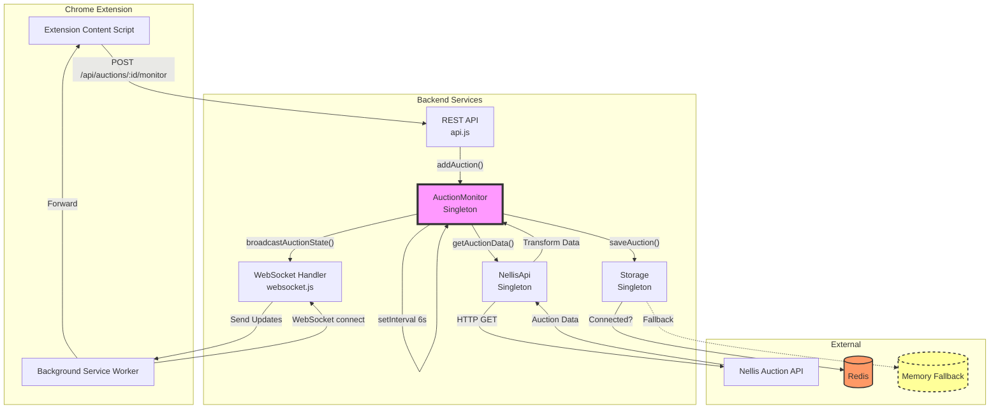
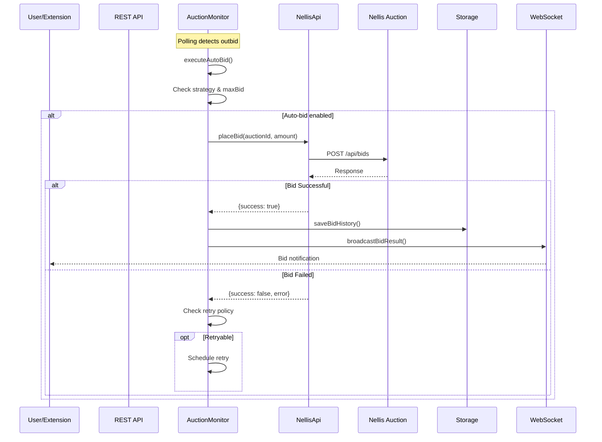
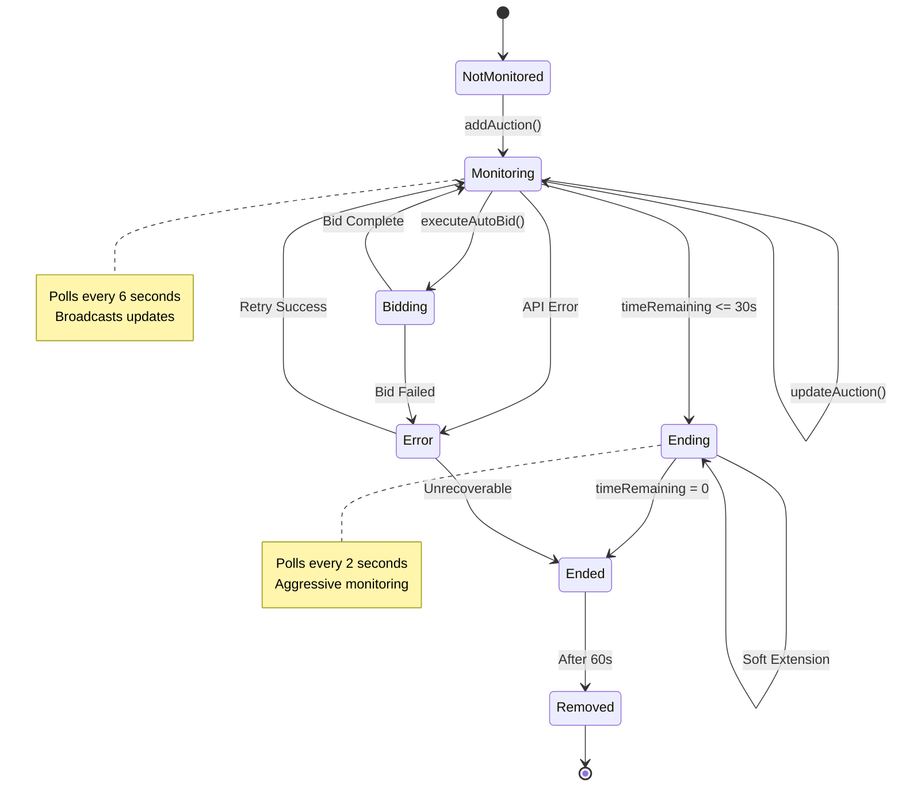
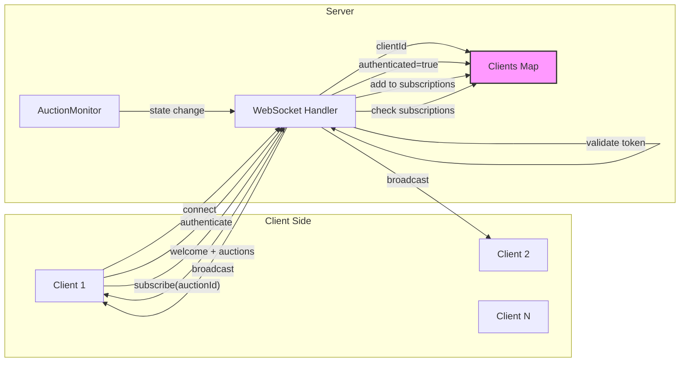
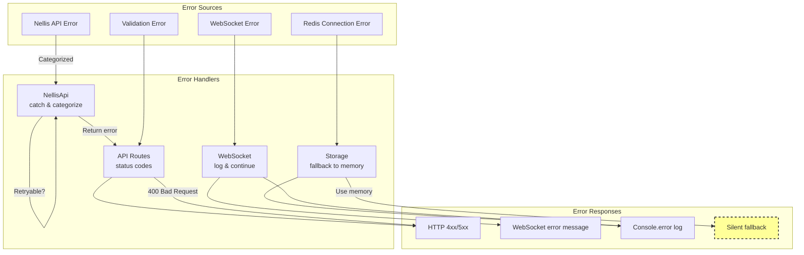
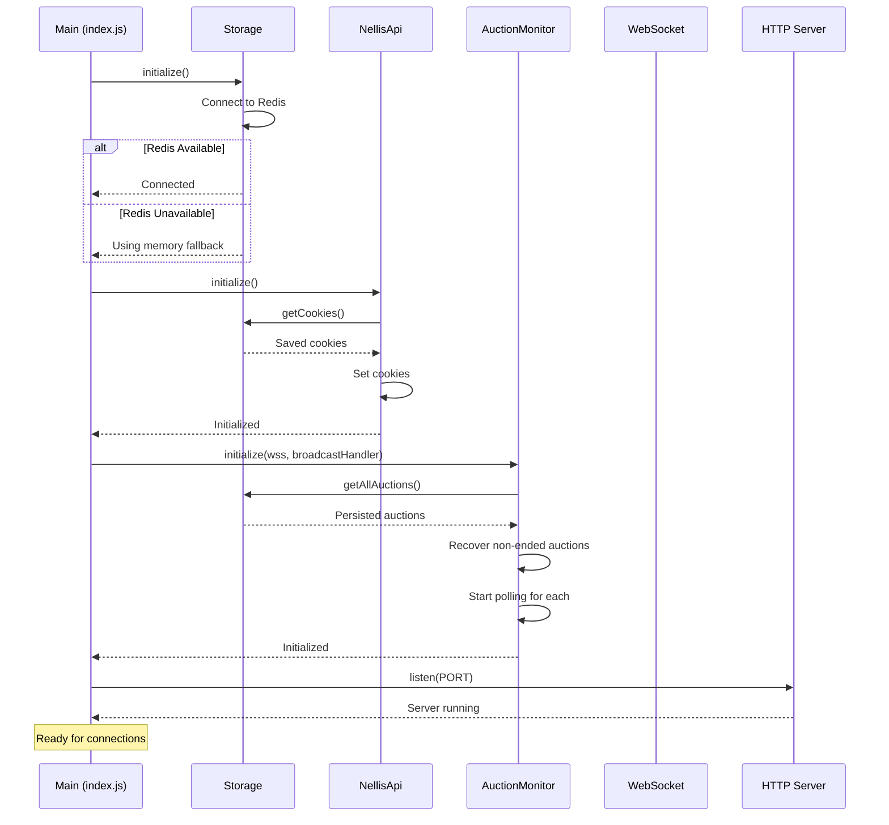
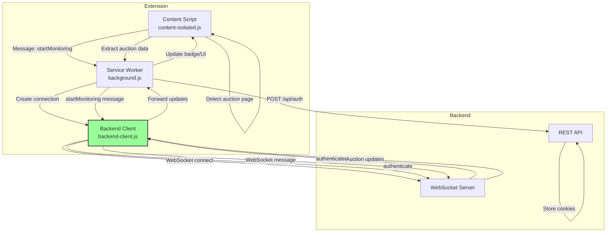

# Data Flow Diagrams - Current Architecture

## 1. Auction Monitoring Data Flow

## 2. Bidding Flow

## 3. State Transitions

## 4. WebSocket Message Flow

## 5. Error Propagation Flow

## 6. Initialization Sequence

## 7. Chrome Extension Integration

## Key Data Flow Issues Identified

1. **No Request Queuing**: All operations happen immediately, can overwhelm systems
2. **Synchronous Broadcasts**: WebSocket broadcasts block other operations  
3. **No Backpressure**: Polling continues even if previous requests haven't completed
4. **State Scattered**: Auction state exists in multiple places without sync
5. **No Transaction Boundaries**: Multi-step operations have no rollback